本项目为本科课程设计项目，时间比较久远，已经停止维护，一些异常是由于包版本或者python版本兼容性的问题导致的（例如一些三方加密包）。由于个人没有多余的精力重新维护该项目，故无法提供支持，望理解。如有对本项目感兴趣的小伙伴欢迎修复并提交合并。有维护意向的小伙伴欢迎与我联系。


## 0 快速开始 (Quick Start)

### 环境要求
- Python 3.x
- macOS / Linux / Windows

### 1. 安装依赖
建议使用 `pip` 安装项目所需的依赖库：

```bash
# 使用 Makefile
make install

# 或者手动安装
pip install -r requirements.txt
```

### 2. 运行软件
你需要启动两个终端窗口，一个运行服务器，一个运行客户端。

**步骤 1：启动服务器**
```bash
# 使用 Makefile
make server

# 或者手动运行
python3 Server.py
```
*注意：服务器启动后会显示 "正在监听中..."*

**步骤 2：启动客户端**
```bash
# 使用 Makefile
make client

# 或者手动运行
python3 Client.py
```

### 3. 使用说明
1. **建立连接**：客户端启动后，会自动尝试连接本地服务器 (127.0.0.1:4396)。如果连接成功，你会看到提示 "连接成功"。
2. **发送消息**：在输入框输入文字，点击“发送”按钮或按键盘的上方向键 `↑` 发送加密消息。
3. **文件传输**：点击“上传文件”按钮选择文件进行加密传输。
4. **设置 IP**：如果服务器和客户端在不同机器上，点击“设置ip”按钮修改目标服务器的 IP 地址。

### 常见问题
- **端口被占用**：如果提示端口被占用，请确保没有其他程序占用 4396 或 7932 端口，或者在 `Server.py` 和 `Client.py` 中修改端口配置。
- **macOS 崩溃问题**：已修复 macOS 下 Tkinter需要在主线程运行的问题。如果遇到 crash，请确保使用的是最新代码。

---

## 1 设计思路

在本安全通讯系统中，我采用了先签名后加密的设计思路，并且结合了电子信封将对称密钥通过非对称加密，实现密钥安全传输的一次一密加密系统。提供了保密性、消息认证和数字签名。在系统连接之初，双方生成公钥私钥后，进行公钥交换，通过SHA256算法生成数字摘要，提供完整性校验。本系统单钥加密算法采用CBC模式的AES算法，用于对消息和签名一起进行加密和解密。非对称加密算法采用RSA,用于签名和验证签名，加密密钥和解密密钥。系统采用CS模式的TCP连接，消息系统和文件传输系统采用独立线程，同时GUI也单独运行在一个线程中。消息系统和文件系统采用相同的加密算法，实现上略有不同，消息系统建立的是长连接。文件系统传送文件时建立连接，传送完成即断开连接。编程语言采用Python。

### 1.2   发送方加密过程

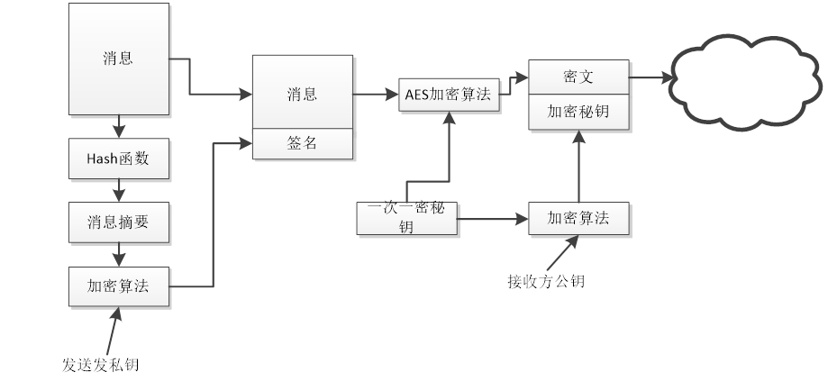

### 1.3    接收方解密过程

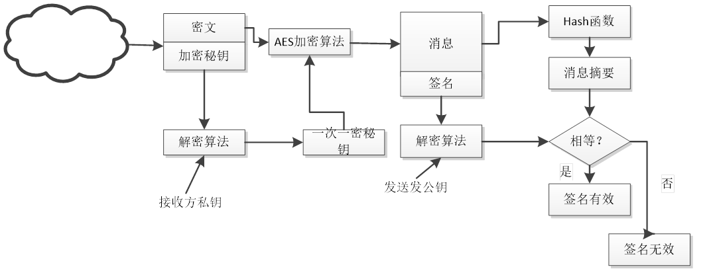

### 1.4  软件界面

 

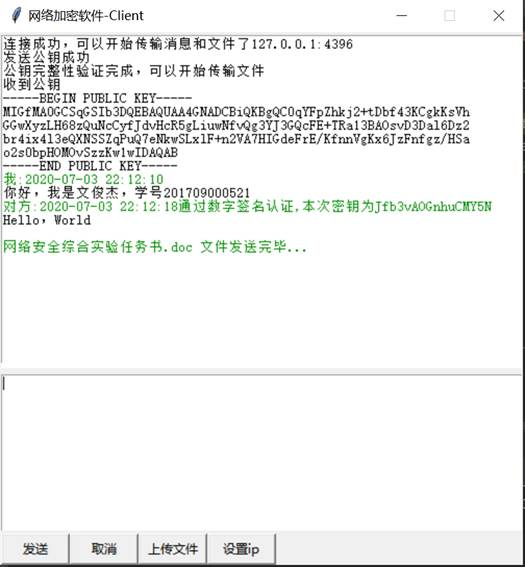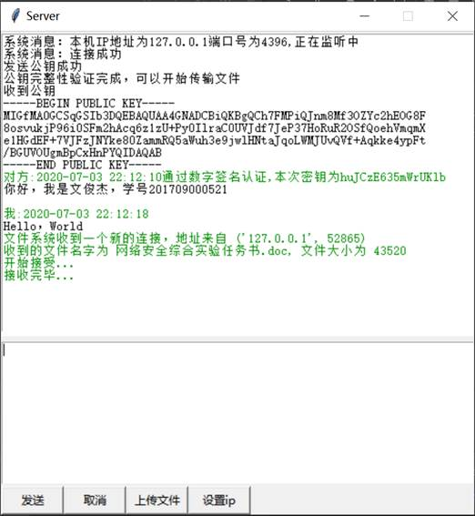

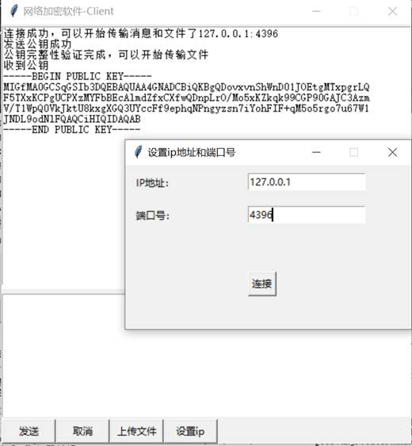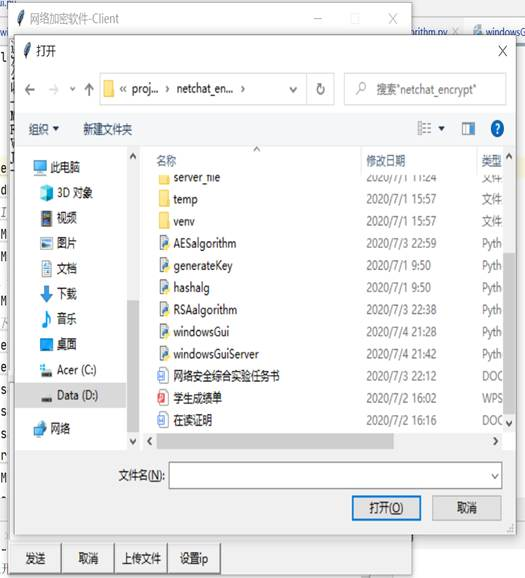

 

 

## 2 核心算法

### 2.1 RSA算法

RSA算法使用发送方的私钥进行签名，使用对方公钥对单次密钥进行加密。接收方使用公钥解密单次密钥并通过发送方公钥验证签名。

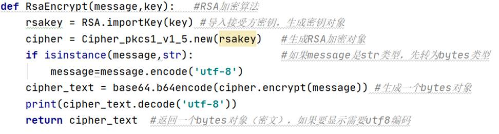

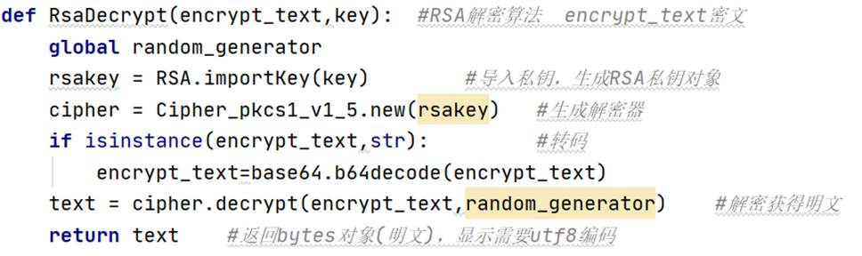

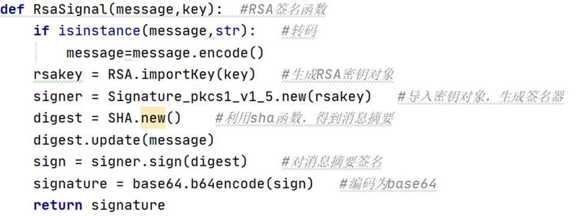

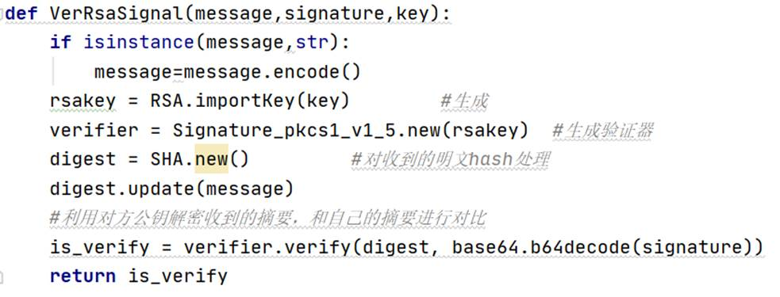

### 2.2 CBC模式的AES算法

CBC模式（密码分组链接），该模式的特点是使得每个分组加密依赖于所有以前的分组。AES算法采用的密钥长度和分组长度都是128位，如果分组长度不满足128位要进行填充。

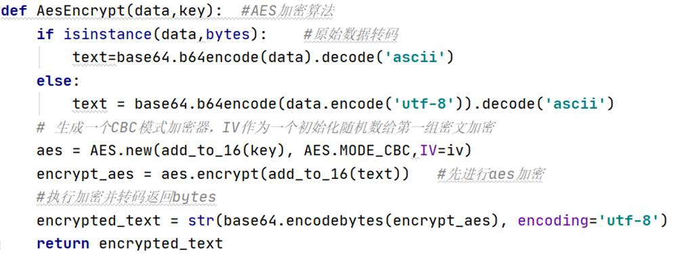

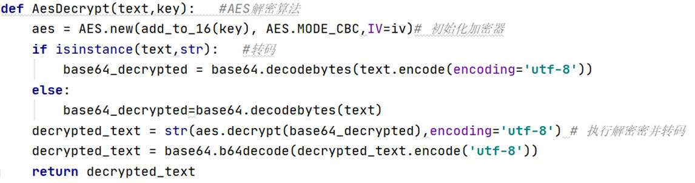

### 2.3 加密过程（以传送消息为例，文件传输类似，实现略有不同）

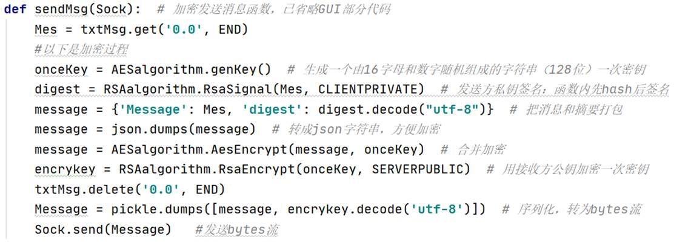

### 2.4 解密过程

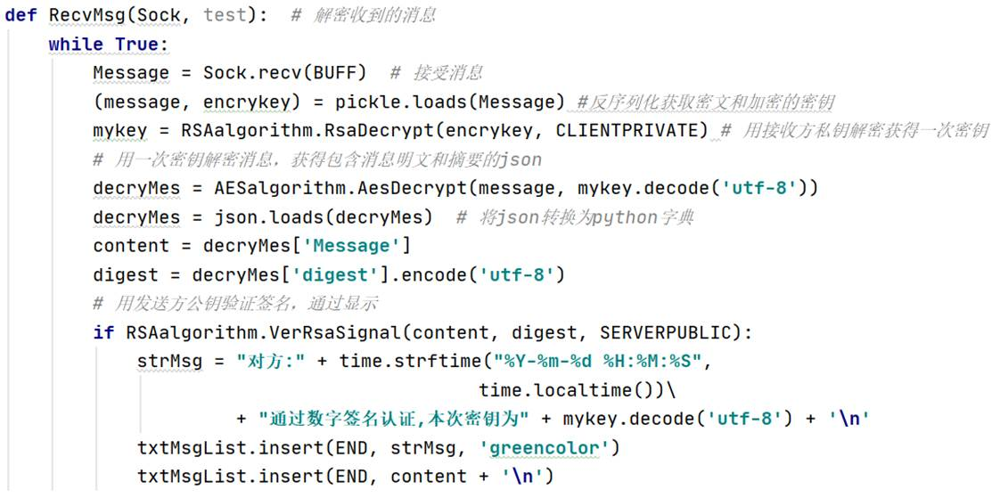

### 2.5 文件传输的加解密

文件传输采用的加解密过程和消息传输一样，采用先签名后加密的思想，并且签名前先生成消息摘要。密钥通过对方公钥进行加密，一并传输。消息传输和文件传输最大的区别是，文件大小不确定，每次发送的文件大小可能不一样，格式多样。并且因为socket缓冲区大小有限，为了实现大文件传输，必须要将大文件拆分，分段传输。每一次从文件中读取固定长度，然后对该部分内容加密后发送，由于每一段密文长度可能不同（最后一段和前面段），那么在传送每一段前先发送一个该段加密后的长度，便于接收方设置接受缓存。同时，为了解决文件格式以及方便接收方对文件完整性检验，需要在建立传输连接时，将文件名、格式、大小等信息传送给接收方。对每一段加密和解密的过程同消息传输。以下是部分核心代码。

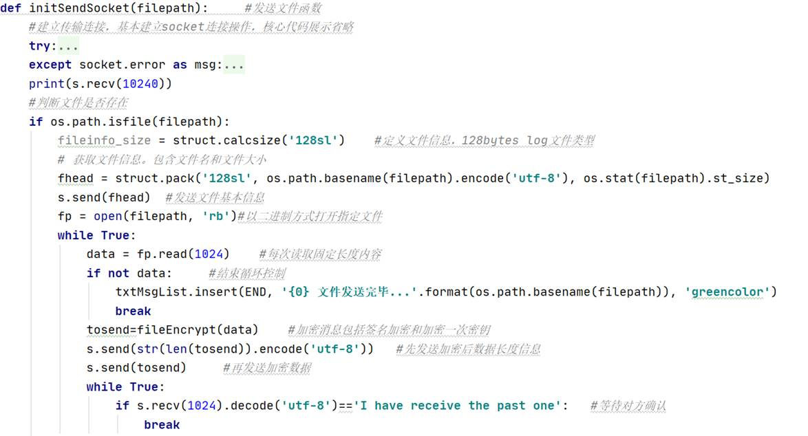

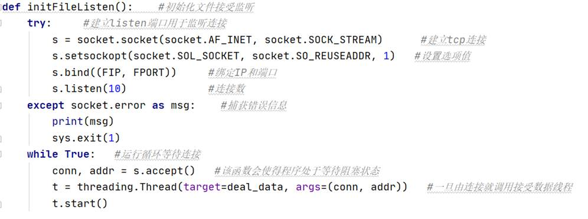

 
